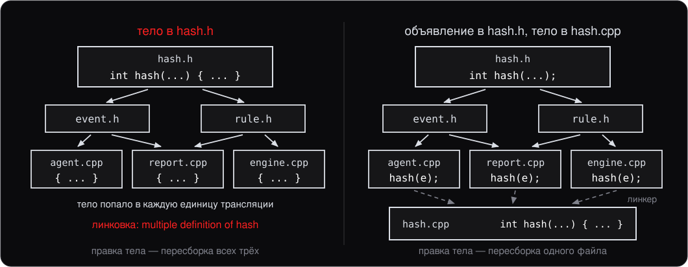
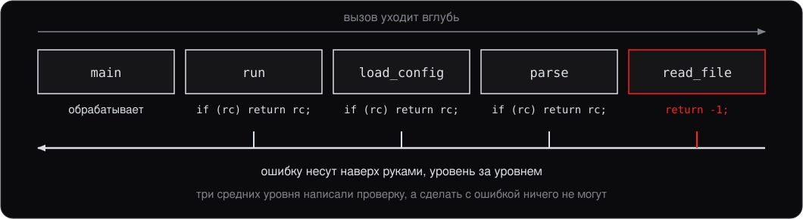

<style>
section {
    font-size: 25px;
}
</style>

<!-- _class: lead -->

# Лекция 3.

## Функции, ссылки, константы, касты

---

# План

1. Функции
2. Ссылки
3. Константы и способы передачи в функцию
4. Касты
5. Как функция сообщает об ошибке

---
<!-- header: 1. Функции -->

# 1. Функции

Функция — именованный блок кода, который можно вызвать. Сигнатура (signature):

```cpp
return_type function_name(param_type param_name, ...) {
    // тело
    return value;
}
```

```cpp
int add(int a, int b) {
    return a + b;
}

int x = add(2, 3);   // 5
```

`void` означает «функция не возвращает значения».

---

## 1.1 Объявление vs определение

```cpp
int add(int a, int b);          // объявление (прототип)

int add(int a, int b) {          // определение
    return a + b;
}
```

Объявление говорит компилятору, что функция существует, и позволяет её вызывать. Определение — тело.

Внутри одной программы определение должно быть **ровно одно** (One Definition Rule).

---

## 1.2 Где лежит объявление, а где тело



**Правило:** в заголовке — объявление, в `.cpp` — тело. Исключения — `inline` и шаблоны, о них дальше.

---

## 1.3 Аргументы по умолчанию

```cpp
void greet(const std::string& name, bool loud = false) {
    if (loud) std::print("HELLO, {}!\n", name);
    else      std::print("Hello, {}.\n", name);
}

greet("Anna");          // loud = false
greet("Anna", true);    // loud = true
```

Правила:

- Значения по умолчанию идут **только подряд справа**: нельзя `void f(int a = 0, int b)`
- Объявляются обычно в **заголовочном файле** (там, где прототип)
- В определении (`.cpp`) повторно не пишутся

---

## 1.4 Перегрузка функций (overloading)

В C++ можно иметь несколько функций с **одним именем**, если они различаются параметрами:

```cpp
int max(int a, int b)         { return a > b ? a : b; }
double max(double a, double b){ return a > b ? a : b; }

max(3, 5);       // вызовется int-версия
max(3.0, 5.0);   // вызовется double-версия
```

Перегрузка **не различает** функции по возвращаемому типу — только по параметрам:

```cpp
int f();
double f();      // CE: redefinition
```

---

## 1.5 Разрешение перегрузки (overload resolution)

Когда вы вызываете функцию, компилятор выбирает перегрузку по простым правилам:

1. **Точное совпадение** типов аргументов лучше всего
2. Если точного нет — ищется **наименьшее преобразование**
3. Если нашлось несколько одинаково хороших вариантов — **CE: неоднозначный вызов** (ambiguous call)

```cpp
void f(int);
void f(double);
f(5);          // f(int) — точное совпадение
f(5.0);        // f(double) — точное
f(5.0f);       // CE: float одинаково можно конвертировать и в int, и в double
```

Подробности — на лекции 8 (после шаблонов).

---

## 1.6 Указатель на функцию

Функция — тоже сущность с адресом. Можно сохранить указатель на неё:

```cpp
int add(int a, int b) { return a + b; }
int sub(int a, int b) { return a - b; }

int (*op)(int, int) = add;   // указатель на функцию
std::print("{}\n", op(2, 3));   // 5

op = sub;
std::print("{}\n", op(2, 3));   // -1
```

Массив из пар «имя — указатель на функцию» — это простейший движок правил, и ровно его вы напишете на занятии 1.3.

В современном коде вместо «голых» указателей на функции используются **лямбды** и `std::function` (лекция 10) — они куда удобнее.

---

## 1.7 `inline` функции

`inline` — это **подсказка** компилятору: «подставь тело этой функции по месту вызова».

```cpp
inline int square(int x) { return x * x; }
```

Главный практический смысл `inline` в современном C++ — **разрешить определение функции в заголовочном файле** без нарушения ODR. Встраивание (inlining) компиляторы и так делают сами, когда считают нужным.

Шаблонные функции и `constexpr`-функции — **автоматически inline** в этом смысле.

---
<!-- header: 2. Ссылки -->

# 2. Ссылки

**Ссылка** — это второе имя для существующего объекта.

```cpp
int x = 5;
int& y = x;        // y — другое имя для x

y = 10;
std::print("{}\n", x);   // 10
```


---

## 2.1 Ссылка vs указатель

| | Ссылка `T&` | Указатель `T*` |
|---|---|---|
| Может быть пустой | нет | да (nullptr) |
| Должна быть инициализирована при объявлении | да | нет |
| Можно «переадресовать» | нет | да |
| Синтаксис доступа | как обычная переменная | через `*` и `->` |

**Правило большого пальца:** если объект **гарантированно есть** и не меняется — используйте ссылку. Если может быть пусто или нужно «менять цель» — указатель (или `std::optional<T&>` в C++26).

---

## 2.2 Пример: `swap`

Без ссылок поменять две переменные местами через функцию нельзя:

```cpp
void swap_bad(int a, int b) {     // принимаем копии
    int tmp = a; a = b; b = tmp;  // меняем копии — оригиналы не задеты
}
```

Со ссылками:

```cpp
void swap_good(int& a, int& b) {
    int tmp = a; a = b; b = tmp;
}

int x = 1, y = 2;
swap_good(x, y);
std::print("{} {}\n", x, y);   // 2 1
```

В стандарте есть `std::swap` (header `<utility>`), который делает ровно это.

---

## 2.3 Возврат ссылки из функции

Можно возвращать ссылку — это даёт «прямой доступ» к объекту через результат функции:

```cpp
std::vector<int> v = {1, 2, 3};

int& first(std::vector<int>& v) {
    return v[0];        // ссылка на первый элемент
}

first(v) = 42;
std::print("{}\n", v[0]);   // 42
```

Так устроены, например, `operator[]` у контейнеров — он возвращает ссылку, чтобы можно было `v[i] = x`.

---

## 2.4 Опасность: висячая ссылка (dangling reference)

```cpp
int& bad() {
    int x = 5;
    return x;        // UB: x умрёт по выходу из функции
}

int& y = bad();
std::print("{}\n", y);   // UB
```


---

## 2.5 Когда ссылку возвращать можно

**Никогда не возвращайте ссылку на локальную переменную.** Компиляторы предупреждают (`-Wreturn-local-addr`), но не всегда.

Возвращать ссылку безопасно только на то, что **переживёт** возврат:

- на элемент контейнера, который пришёл по ссылке
- на статическую или глобальную переменную
- на поле объекта, чьё время жизни (lifetime) вы понимаете

---
<!-- header: 3. const и передача -->

# 3. Константы и способы передачи в функцию

1. `const` на значениях и ссылках
2. Четыре способа передачи параметра
3. Какой способ когда выбирать

---

## 3.1 `const` на значениях

```cpp
const int x = 5;
x = 10;        // CE: assignment of read-only variable

int y = 5;
y = 10;        // ok
```

`const` запрещает изменять переменную после инициализации. Полезно для:

- констант времени компиляции (`const int kBufferSize = 1024;`)
- параметров, которые функция не должна менять
- защиты инвариантов класса (`const`-методы, лекция 4)

`constexpr` ≠ `const`. `const` — нельзя менять. `constexpr` — известно на компиляции (подразумевает `const`).

---

## 3.2 `const` на ссылках

```cpp
int x = 5;
const int& cr = x;     // ссылка на const int
// cr = 10;            // CE: cannot assign through const ref
x = 10;                // ok: сам x не const
std::print("{}\n", cr);   // 10 — cr видит новое значение
```

Через `const&` нельзя **писать**, но видны **изменения** оригинала. Это самая частая ссылка в коде C++: передача параметров большого размера без копирования.

---

## 3.3 Четыре способа передачи в функцию


Разница одна: функция получает **свою копию** или **доступ к оригиналу**.

---

## 3.4 Какой когда

- **По значению** — маленькие типы (`int`, `double`, `char`) и когда нужна независимая копия
- **По ссылке `T&`** — когда нужно **изменить** аргумент
- **По `const T&`** — большие объекты в режиме чтения. Самый частый случай в API
- **По указателю `T*`** — когда аргумент **может отсутствовать** (`nullptr`)

```cpp
void log(const std::string& msg);     // читаем большую строку — const&
void normalize(std::string& s);       // нормализуем на месте — &
int add(int a, int b);                // маленькие типы — по значению
void set_parent(Node* parent);        // может быть null — указатель
```

**Антипаттерн:** `void f(const int& x)` для `int` — по значению дешевле. Move-семантика (move semantics) добавит пятый способ, передачу rvalue: лекция 11.

---
<!-- header: 4. Касты -->

# 4. Касты

В C++ четыре каста (casts) — способа явно преобразовать тип:

- `static_cast<T>(x)` — «обычные» преобразования
- `reinterpret_cast<T>(x)` — переинтерпретация битов
- `const_cast<T>(x)` — снятие/добавление `const`
- `dynamic_cast<T>(x)` — для иерархий классов (лекция 7)

Плюс C-style каст `(T)x` — наследие C, **в новом коде не пишите**.

---

## 4.1 `static_cast`

Большинство «обычных» преобразований:

```cpp
double d = 3.14;
int i = static_cast<int>(d);          // 3 (отбрасывает дробную часть)

int a = 1, b = 3;
double r = static_cast<double>(a) / b;   // 0.333..., иначе было бы 0

void* p = &i;
int* pi = static_cast<int*>(p);       // void* → int*
```

`static_cast` проверяется компилятором: запрещены семантически неосмысленные преобразования (`int*` → `double*`).

---

## 4.2 `reinterpret_cast`

«Переинтерпретируй биты как другой тип». Очень опасный каст:

```cpp
int x = 0x41414141;
char* p = reinterpret_cast<char*>(&x);
std::print("{} {} {} {}\n", p[0], p[1], p[2], p[3]);
// 65 65 65 65  (биты как 4 байта 'A')
```

Применяется в системном коде: сериализация в байты, работа с регистрами, манипуляции с памятью на низком уровне.

**99% обычного кода не должен использовать `reinterpret_cast`.** Если вы пишете его — поставьте себя под вопрос «точно нет другого способа?».

---

## 4.3 `const_cast`

Снимает (реже — добавляет) `const`:

```cpp
void legacy_api(char* s);     // C-API, не помечена const

void modern_wrapper(const std::string& s) {
    legacy_api(const_cast<char*>(s.c_str()));   // ok если API на самом деле не пишет
}
```

**Если объект изначально объявлен как `const`, снимать у него `const` и писать — UB.**

```cpp
const int x = 5;
int& nc = const_cast<int&>(x);
nc = 10;                       // UB
```

Применяется почти только на границе со старыми C-API, забывшими про `const`.

---

## 4.4 C-style каст — почему плохо

```cpp
double d = 3.14;
int i = (int)d;            // C-style: «преобразуй как умеешь»
```

C-style каст пробует по очереди `const_cast`, `static_cast`, `static_cast` +
`const_cast`, `reinterpret_cast`, `reinterpret_cast` + `const_cast` — и берёт
первое, что сработало.

Проблема: вы не видите, **что именно** произошло. Опечатка в типе превращает невинный `(int)x` в `reinterpret_cast`, и компилятор молчит.

**Правило:** в новом коде только C++-касты. C-style — индикатор кода, написанного до 2000-х, или людьми, не знающими C++.

---

## 4.5 Функциональная запись и `T{x}`

```cpp
int i = int(3.14);            // эквивалент (int)3.14 — всё та же боль
auto p = Point(3, 4);         // для классов это вызов конструктора
```

Инициализация списком (list-initialization) **запрещает сужающие преобразования** (narrowing):

```cpp
int i2 = int{3.14};     // CE: narrowing conversion from 'double' to 'int'
char c = char{1000};    // CE: 1000 не влезает в char
```

`T{x}` ловит случайные потери точности. Если усечение действительно нужно — пишите явно `static_cast<int>(x)`.

---

## 4.6 Сводка

| Каст | Когда |
|---|---|
| `static_cast` | «обычные» преобразования: между числами, базовый ↔ производный, через `void*` |
| `reinterpret_cast` | сериализация, биты, низкий уровень — редко |
| `const_cast` | снятие const для C-API — почти никогда |
| `dynamic_cast` | полиморфные иерархии — лекция 7 |
| C-style `(T)x` | не пишем |

**Если не уверены — `static_cast`.** Это самый безопасный из четырёх.

---
<!-- header: 5. Сообщение об ошибке -->

# 5. Как функция сообщает об ошибке

Мы научились возвращать **результат**. Но функция не всегда может выполнить свой контракт:

```cpp
int parse_port(const std::string& s);   // а если s = "abc"?
double divide(double a, double b);      // а если b == 0?
std::string read_file(const char* p);   // а если файла нет?
```

Возвращать здесь нечего — и это **не** ошибка программиста, которую видно на компиляции. Это нормальная ситуация во время работы.

Вопрос: **что функция вернёт вызывающему в таком случае?**

На занятии 1.3 этот выбор делается не по настроению в каждой функции, а один раз на всю группу функций доступа к полям события.

---

## 5.1 Способ 1: особое значение

Самое простое — договориться, что одно из значений результата означает неудачу.

```cpp
int parse_port(const std::string& s) {
    if (!is_number(s)) return -1;       // -1 = «не смог»
    /* ... */
}

int port = parse_port(argv[1]);
if (port < 0) { /* обработать */ }
```

Так устроены почти все системные API: `open` возвращает `-1`, `malloc` — `nullptr`, `fopen` — `nullptr`.

---

## 5.2 Чем плох особый код

**1. Результат и ошибка живут в одном типе.** `-1` — валидный `int`. Читая сигнатуру `int parse_port(...)`, вы не узнаете, что часть диапазона зарезервирована.

**2. Проверку легко забыть — и компилятор промолчит:**

```cpp
int port = parse_port(argv[1]);
connect(host, port);              // а если port == -1?
```

**3. Особого значения может не быть.** Что вернуть из `divide`, если все `double` — валидный результат?


---

## 5.3 Как ошибка едет наверх



Возникла на пять вызовов глубже — и каждый уровень между местом отказа и местом, где с ошибкой можно что-то сделать, обязан её проверить и вернуть дальше. Забудет один — ошибка исчезнет по дороге.

---

## 5.4 Способ 2: исключения

Исключение — это способ сказать «дальше выполнять не могу» **не через возвращаемое значение**.

```cpp
int parse_port(const std::string& s) {
    if (!is_number(s)) {
        throw std::invalid_argument("port is not a number");
    }
    return std::stoi(s);
}
```

Функция теперь возвращает **только** результат. Неудача сообщается отдельно от него.

---

## 5.5 Как поймать

```cpp
try
{
    int port = parse_port(argv[1]);
    connect(host, port);
}
catch (const std::invalid_argument& e)
{
    std::print("плохой порт: {}\n", e.what());
}
```

- `try` — блок, в котором ошибка возможна
- `throw` — момент, когда мы сдались
- `catch` — кто и как это разбирает

---

## 5.6 Два пути одного вызова


Между `throw` и `catch` может быть сколько угодно вызовов — промежуточные функции о них **не знают**.

---

## 5.7 Что можно бросать

Технически — **объект любого типа**: `throw 42;` скомпилируется.

На практике так не делают. Соглашение: бросаем наследников `std::exception` — у них есть метод `what()` с текстом.

```
std::exception
├── std::logic_error          ошибка в логике программы
│   ├── std::invalid_argument
│   ├── std::out_of_range
│   └── std::domain_error
├── std::runtime_error        не удалось во время работы
│   ├── std::overflow_error
│   └── std::system_error
├── std::bad_alloc            не хватило памяти
└── std::bad_cast
```

---

## 5.8 Ловим по `const&`

```cpp
catch (const std::exception& e)     // так
catch (std::exception e)            // не так
```

Ловля **по значению** копирует объект — и, если брошен был наследник, происходит **срезка** (object slicing): копия обрежется до базового класса. Разберём механизм на лекции 6.

`catch` по базовому типу ловит **все** производные: `catch (const std::exception&)` поймает любое стандартное исключение.

`catch (...)` ловит вообще всё, но не даёт доступа к объекту.

---

## 5.9 Раскрутка стека

Между `throw` и `catch` программа **не** прыгает напрямую — она выходит из каждого кадра по пути, разрушая локальные объекты.


Это называется **раскрутка стека** (stack unwinding).

---

## 5.10 Вот зачем был нужен RAII

На лекции 2 мы говорили: ручной `delete` не переживает ранний выход. Исключение — самый коварный ранний выход: он **невидим в коде**.

```cpp
void f() {
    auto buf = std::make_unique<int[]>(1000);
    might_throw();          // бросит — buf освободится
}                           // не бросит — тоже освободится
```

**Правило:** в коде, где возможны исключения, ресурс обязан лежать в RAII-обёртке. Ручной `delete` между `new` и концом функции — это не «плохой стиль», это утечка (memory leak), которая ждёт исключения.

---

## 5.11 Когда надо использовать

**Исключение — для исключительного.** Не для управления потоком выполнения.

| Ситуация | Механизм |
|---|---|
| Ошибка ожидаема и обрабатывается тут же | код возврата |
| Ошибка редкая, обработчик далеко | исключение |
| Нарушен контракт функции | исключение |
| Конструктор не смог создать объект | исключение (лекция 4) |
| Горячий цикл, ошибка — норма | код возврата |

Пример антипаттерна: искать элемент в контейнере и бросать `not_found`. Ненайденный элемент — это норма, а не авария.

---

## 5.12 `noexcept`

Функцию можно пометить как «не бросает»:

```cpp
int size() const noexcept { return size_; }
```

Это не проверка, а **обещание** компилятору. Если из `noexcept`-функции всё-таки вылетит исключение — программа немедленно завершится через `std::terminate`, без раскрутки стека.

Зачем: компилятор оптимизирует агрессивнее, а стандартная библиотека принимает решения по этому признаку. На лекции 11 увидим, как `noexcept` на move-конструкторе (move constructor) меняет поведение `std::vector`.

---

## 5.13 Правило курса

Пока у нас нет `std::optional` и `std::expected` (лекция 14), на практических заданиях:

1. **Нарушение контракта** (неверный аргумент, выход за границы) — `throw std::invalid_argument` / `std::out_of_range`
2. **Ожидаемое «не получилось»** — код возврата или флаг
3. **Любой ресурс — в RAII-обёртке.** Без исключений это дисциплина, с исключениями — необходимость

Полное сравнение всех трёх подходов и `std::expected` — на лекции 14.

---
<!-- header: Итоги -->

# Итоги лекции

- **Функции:** аргументы по умолчанию, перегрузка по типам параметров, `inline` для размещения в `.h`
- **Ссылка** — второе имя объекта. Должна быть инициализирована, нельзя переадресовать
- **4 способа передачи:** по значению, `&`, `const&`, `*`. Большие объекты в read-only режиме — `const&`
- **Касты:** `static_cast`, `reinterpret_cast`, `const_cast`. C-style не пишем. `dynamic_cast` — позже
- **Ошибки:** код возврата — для ожидаемого, исключение — для исключительного. Ловим по `const&`
- **Раскрутка стека вызывает деструкторы, но не `delete`** — поэтому ресурсы в RAII

---

# Дальше

Следующая лекция — **введение в ООП**:

- Классы и структуры в C++
- Поля, методы, `this`
- Спецификаторы доступа (access specifiers)
- Конструкторы, деструкторы
- `explicit`, делегирующие конструкторы, `= default` / `= delete`
- Ошибка в конструкторе — единственный случай, где выбора нет
- Designated initializers (C++20)
